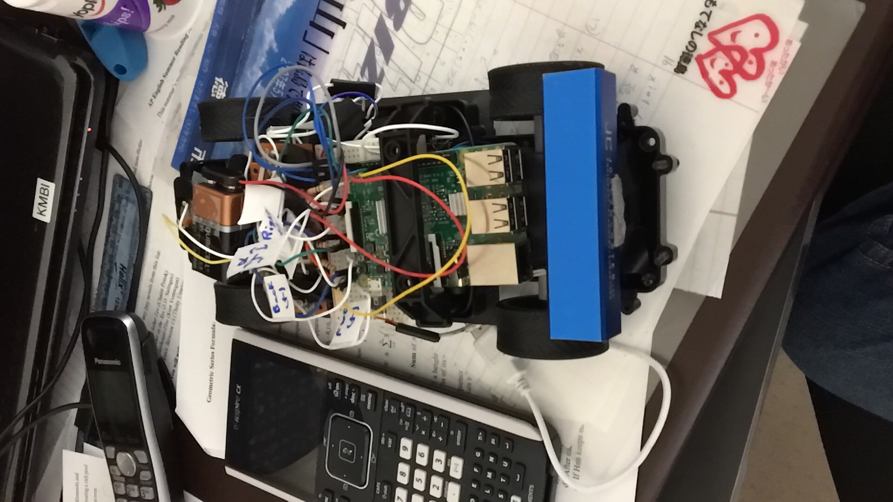

# wifiRC
My radio controlled car only worked when the transmitter was within very close range of the reciever. I came up with a solution that allows me to control the car from anywhere with wifi internet access by interfacing a raspberry pi with the circuit of the transmitter and inserting it in the car body. The rapsberry pi runs a web server interprets arrow key presses calls a php script. The php script runs a python script to control voltages of the GPIO pins which interface onto the circuit of the transmitter via transistors.

